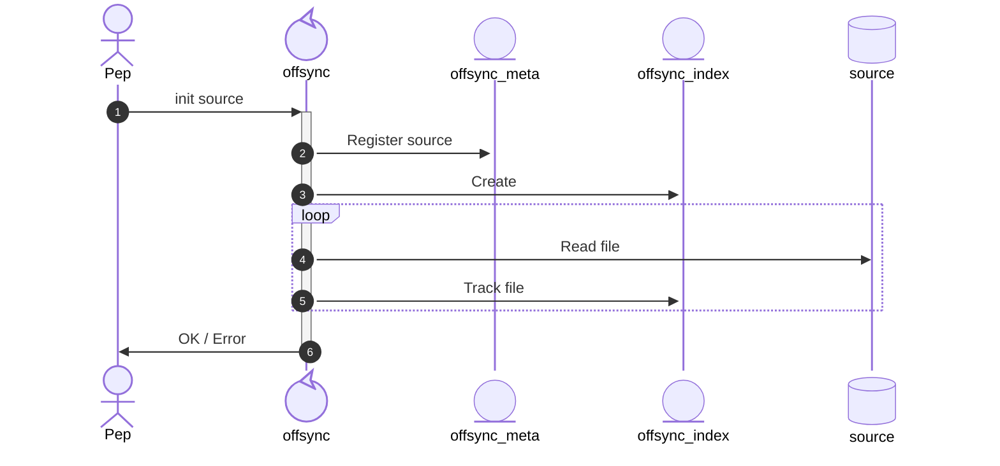
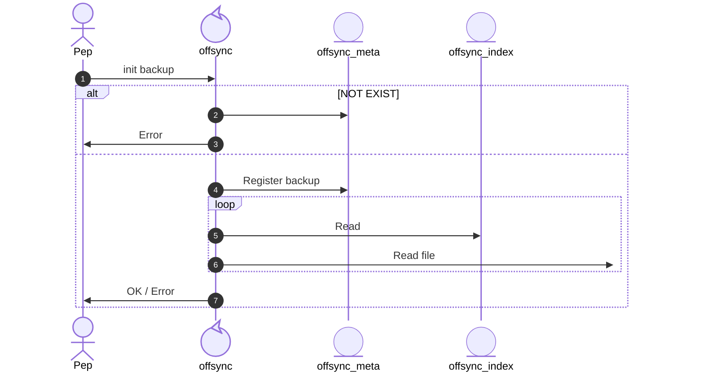
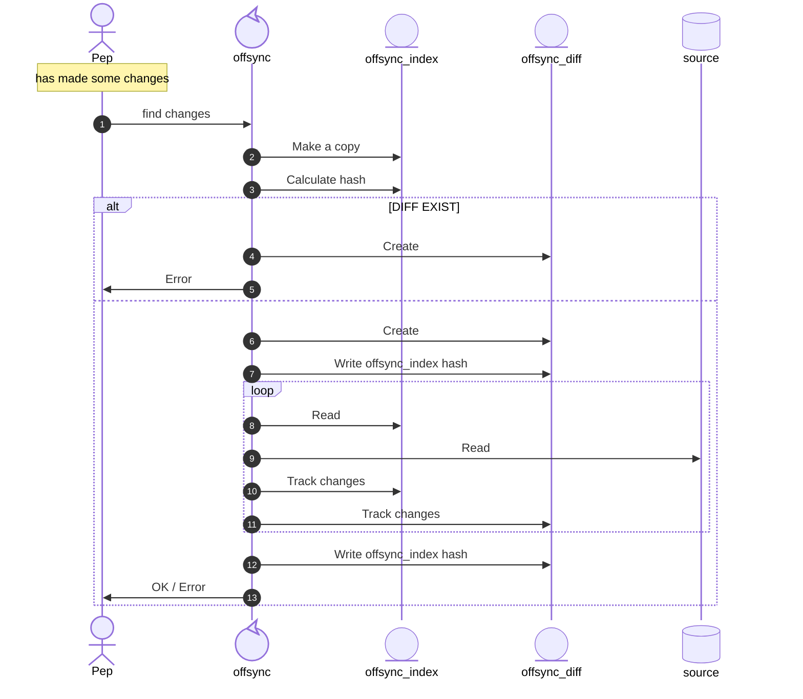
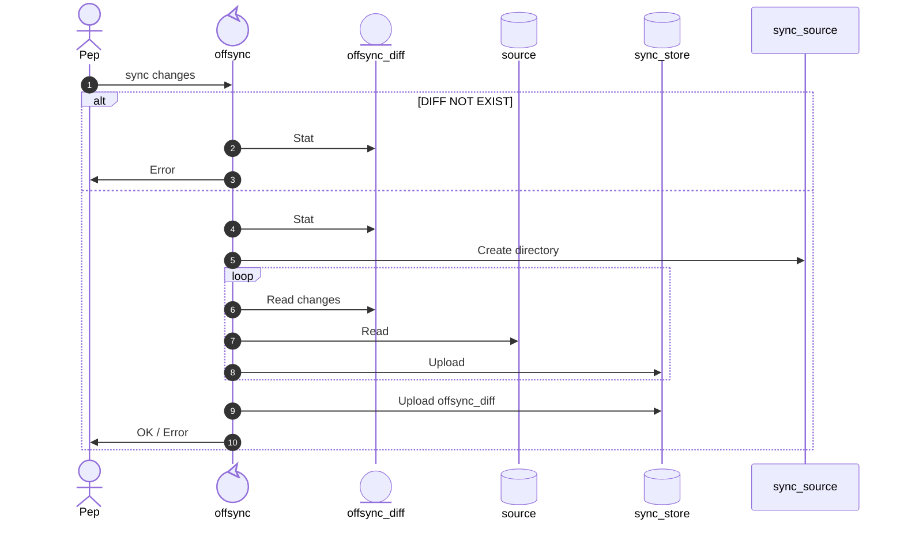
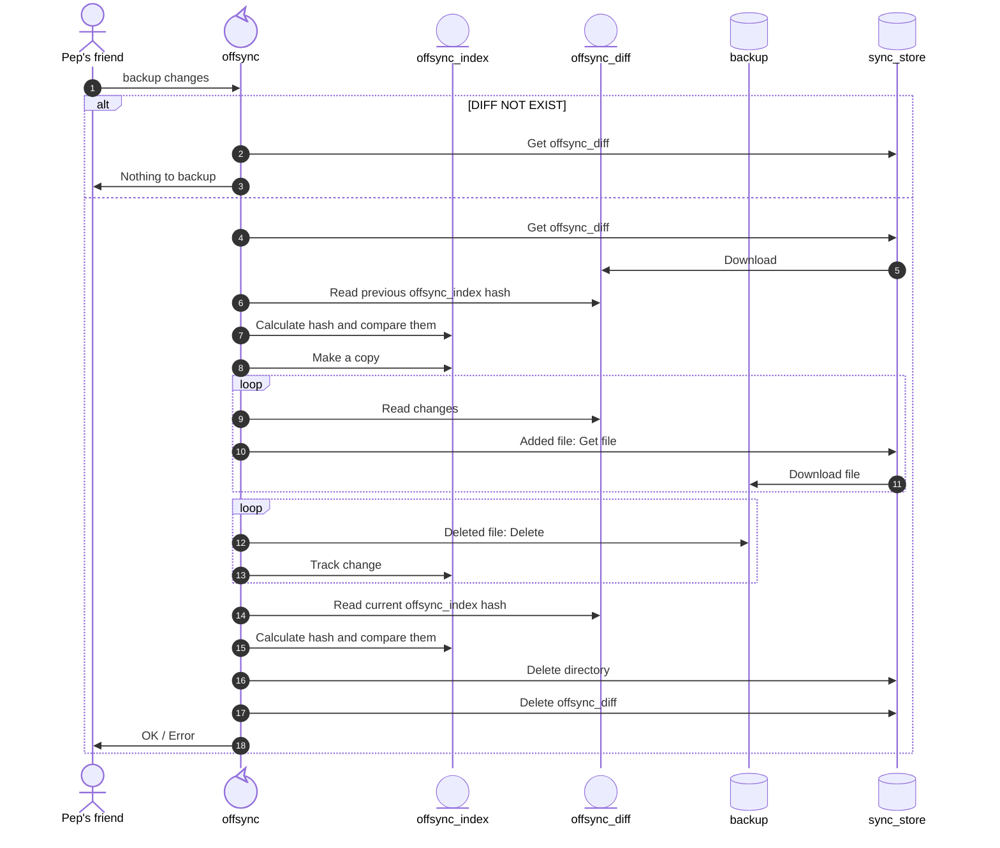

# Functional specification

This document currently specifies v1. V1 specifies the basic functionalities to serves the `ofsync`
main purpose.

`offsync` is a one way file synchronization tool with the particularity that doesn't require the
source and the backup to stay online at the same time, and without having to be present in the same
physical location.

The common usage application flow when a user start to use `offsync` is:
1. Initialize source.
2. Create index.
3. User create a manual copy of source to another disk.
4. Initialize the backup disk.
5. At some point, user makes some changes in the source. Then it syncs the index to find the changes
   and generate a diff file.
6. User uploads the changes to the sync storage, usually a cloud provider.
7. At some point, user's friend, who custodies the backup, synchronizes the changes with the backup.

The next section provides details of each step.

## Initialize source

When a user wants to start using `offsync`, first it has to initialize the path that want to
synchronize, call it source.

This operation does:
1. Create an `offsync` metadata file if it doesn't exist yet. This file will keep metadata as a
   source ID, last time of the last sync, etc.
2. Create an `offsync` index file. This file tracks all the sources directories and files into this
   file to be able to identify, in the future, changes in the source.

## Initialize backup

First of all, the user must manually replicate the source to another disk, call it backup.

In theory it could start from an empty source and empty backup, then add all the files to the
source to later synchronize them to the backup. This is not recommended unless that the user is
starting a fresh empty source that it will start to add files through the time, because if the firs
backup has a big amount of data may not fit into the exchange store and `offsync` won't be able to
synchronize.

This operation does:
1. Verify that the `offsync` metadata file exist, otherwise, return an error.
   This verification ensures that this backup start with a copy of an `offsync` source as an initial
   point.
2. Register the backup in the `offsync` metadata file. This update the copied metadata file from the
   source to identify that this path is a backup instead of a source.
3. Check that path and `offsync` index are in sync, otherwise return an error.

## Find changes

This command requires that the [source is initialized](#initialize-source) by checking that the
`offsync` index file exists and it's identified as a source.

User makes some changes int the source path and then executed `offsync` to find all the changes.

This operation does:
1. Make a copy of the `offsync` index, so it can be restored if it gets corrupted during this
   operation.
2. Verify if an `offsync` diff file exists.
    - (a) EXISTS: it returns an error because previous synchronized changes aren't backed up yet.
    - (b) DOES NOT EXIST: it creates the file.
3. Compares the files in the path with the `offsync` index to detect changes and register them in
   `offsync` index and diff files.

The `offsync_diff` file contains a hash of the `offsync_index` before and after changes are
registered. These hashes are used by the backup to detect possible differences between the source
and the backup before and after the changes are applied.

## Sync changes

This command requires that the [source is initialized](#initialize-source) by checking that the
`offsync` index file exists and it's identified as a source.

Once changes are calculated by the [find changes operation](#find-changes), the changes must be
stored in the _sync store_.

As _sync store_ is storage unit used to temporarily store the changes until the they are
synchronized to the backup. These storage units are usually a path in a cloud provider under a
certain account.

This operation does:
1. Verify if an `offsync` diff file exists.
    - (a) DOES NOT EXISTS: it returns an error there aren't changes to sync.
    - (b) DOES EXIST: it continues.
2. Create a directory in _sync store_ to upload. The name of this directory must be somehow
   determined by the `offsync` diff file.
3. Select the new added files from the `offsync` diff file and upload them into the _sync store_
   directory created in step 2.
3. Upload the `offsync` diff file into the _sync store_'s root path.

## Backup changes

This command requires that the [backup is initialized](#initialize-backup) by checking that the
`offsync` index file exists and it's identified as a backup.

Once changes are calculated by the [sync changes operation](#sync-changes), the backup destination
copy the changes into to it, and delete the changes from _sync store_.

This command requires that the source is initialized by checking that the `offsync` index file
exists and it's a source.

This operation does:
1. Verify if an `offsync` diff file exists in the root path.
    - (a) DOES NOT EXISTS: inform the user that there isn't anything to backup.
    - (b) DOES EXIST: it continues.
2. Download the `offsync` diff file.
3. Calculate hash from the local `offsync` index file and compare it with the one informed in the
   `offsync` diff file. Return an error to the user, if the hashes don't match, otherwise continue.
4. Make a copy of the `offsync` index file in case that's needed to be restored.
5. Read changes from `offsync` diff file and apply them.
   - First apply all the _add_ changes. Download the files and add an entry for each one in the
     `offsync` index file.
   - Second apply all the _delete_ change. Delete all the files from the backups and delete their
     entries from the `offsync` index file.
5. Calculate hash from the local `offsync` index (which has the applied changes in the step 4) and
   compare it with the one informed in the `offsync` diff file. Return an error to the user, if the
   hashes don't match, otherwise continue.
6. Delete the directory contained the changes and the `offsync` diff file from the _sync store_, the
   local `offsync` diff file, and the initial copy of the `offsync` index.

NOTE there are two strategies to support temporary network failures which are possible because, the
_delete_ changes are applied after the _add_ changes (which require to download files) are applied.
- (A) Track the progress and if the network fails, the command can be restarted later to continue
  where it was interrupted
- (B) Rollback to the previous state by deleting all the added files. There is no need to remove the
  new added entries from the the index file because there is an initial copy to override the
  modified index.

If a network failure happen during the clean up, the command can only proceed with strategy (B).

There is not restriction on implementing both strategies and give the user to choose which one to
apply each time or set which one to apply (configuration file / environment variable / flag).
